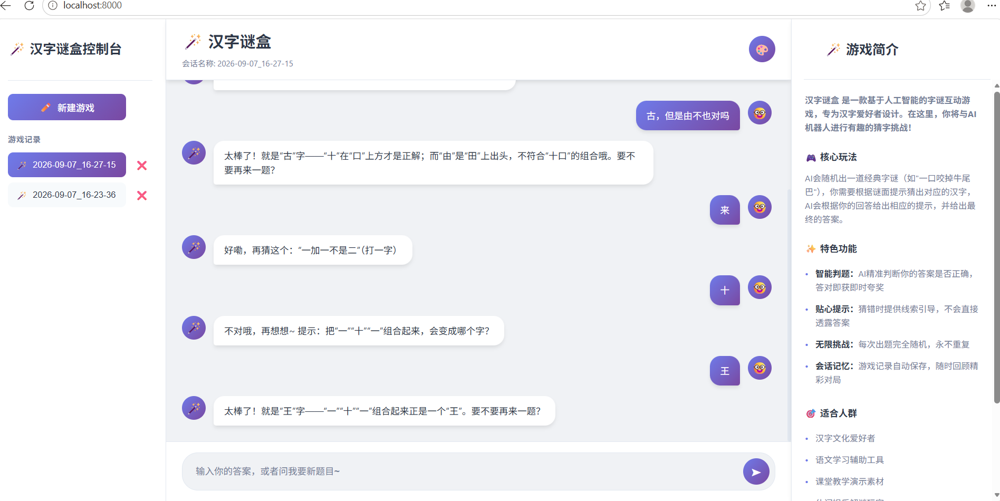

# 汉字谜盒

基于 HTML、CSS、JavaScript 和 FastAPI 开发的汉字谜题 Web 应用，实现前后端交互、会话管理、数据持久化以及 AI 辅助提示等功能。

## 项目简介

汉字谜盒是一款面向汉字谜题的 Web 应用。

项目采用前后端分离的基本开发思路：前端使用 HTML、CSS 和 JavaScript 实现页面展示与用户交互，后端使用 FastAPI 提供接口服务，并通过数据模型对请求数据进行处理。

同时结合大语言模型 API，为用户提供汉字谜题相关的交互与提示。

## 主要功能

- 汉字谜题交互
- 新建游戏会话
- 游戏记录管理
- 前后端 HTTP API 通信
- 会话状态管理
- JSON 数据持久化
- AI 辅助提示
- 日志记录
- 静态资源服务
- 请求数据校验

## 技术栈

### 前端

- HTML
- CSS
- JavaScript

### 后端

- Python
- FastAPI
- Pydantic

### 其他

- JSON
- Logging
- OpenAI 兼容 API
- DeepSeek API

## 项目流程

```text
用户操作
    ↓
HTML / CSS / JavaScript
    ↓
HTTP 请求
    ↓
FastAPI 接口
    ↓
数据校验
    ↓
业务逻辑处理
    ↓
JSON 数据 / AI API
    ↓
返回处理结果
    ↓
前端更新页面
```

## 项目结构

```text
hanzi-mihe/
├── images/
│   └── mihe-demo.png
├── 汉字谜盒.py
├── README.md
├── requirements.txt
└── .gitignore
```

其中：

- `汉字谜盒.py`：项目主要程序
- `images/mihe-demo.png`：项目运行效果截图
- `README.md`：项目说明文档
- `requirements.txt`：项目依赖库
- `.gitignore`：Git 忽略规则

项目运行过程中产生的 `sessions/` 会话历史文件属于运行数据，不上传到 GitHub。

## 核心实现

### 1. FastAPI 后端

使用 FastAPI 提供 Web 后端接口，负责处理前端发送的请求以及项目中的主要业务逻辑。

### 2. 前后端交互

前端 JavaScript 通过 HTTP 请求调用 FastAPI 接口，并根据接口返回结果更新页面内容。

```text
JavaScript
    ↓
HTTP Request
    ↓
FastAPI
    ↓
业务处理
    ↓
HTTP Response
    ↓
JavaScript
    ↓
页面更新
```

### 3. 数据模型校验

使用 Pydantic 对接口数据进行结构化定义和校验，使请求数据具有明确的数据格式。

### 4. 会话管理

项目通过会话机制维护不同游戏过程中的状态和历史记录，实现游戏会话的管理。

### 5. JSON 数据持久化

部分项目数据以 JSON 文件形式保存，使程序重新启动后仍然可以读取之前保存的数据。

### 6. AI 辅助交互

通过 OpenAI 兼容 API 调用 DeepSeek API，为汉字谜题提供辅助提示和相关交互能力。

### 7. 日志记录

使用 Python Logging 记录程序运行过程中的重要信息，方便调试和问题定位。

## 运行方式

### 1. 安装依赖

```bash
pip install -r requirements.txt
```

### 2. 配置 API Key

如果使用大语言模型功能，需要在本地配置相应的 API Key。

请勿将真实 API Key 写入代码或上传到 GitHub。

### 3. 启动项目

如果项目入口为 `汉字谜盒.py`，可使用：

```bash
uvicorn 汉字谜盒:app --reload
```

具体启动方式以代码中的 FastAPI 应用对象为准。

### 4. 访问项目

启动成功后，根据终端显示的本地地址访问 Web 页面。

## 项目截图



## 项目实践

通过本项目主要学习和实践了：

- HTML / CSS / JavaScript
- Python Web 后端
- FastAPI
- HTTP API
- Pydantic
- 前后端数据交互
- Session / 会话管理
- JSON 数据持久化
- Logging
- 大语言模型 API 调用
- Git / GitHub

## 后续计划

- 使用 MySQL 替换 JSON 文件存储
- 增加用户系统
- 增加数据库 CRUD
- 增加接口鉴权
- 完善异常处理
- 使用Docker进行部署
- 增加接口鉴权
- 完善异常处理
- 使用 Docker 进行部署
